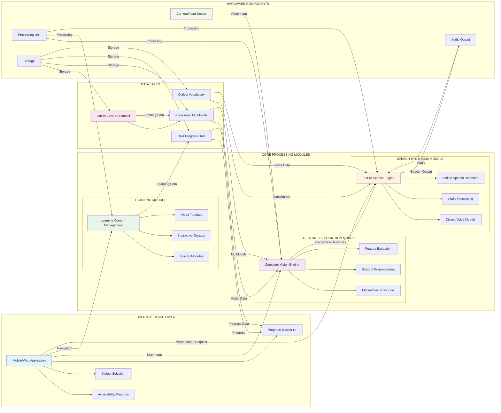

# System Architecture for HandTalk Lokal

## Overview
HandTalk Lokal is an offline-capable hand sign-to-speech translation and learning system for local Filipino dialects. The system uses computer vision and machine learning to recognize Filipino Sign Language (FSL) gestures and convert them into speech in selected local dialects (Ilocano, Hiligaynon, and Maranao).

## System Architecture

## Component Descriptions

### User Interface Layer
- **Mobile/Web Application**: Primary interface for users to interact with the system
- **Accessibility Features**: Large buttons, clear visuals, and voice guidance for users with disabilities
- **Dialect Selection**: Allows users to choose their preferred local dialect (Ilocano, Hiligaynon, or Maranao)
- **Progress Tracker UI**: Visual representation of user learning achievements and improvements

### Gesture Recognition Module
- **Computer Vision Engine**: Core engine responsible for processing visual input
- **MediaPipe/TensorFlow**: Frameworks used for real-time gesture recognition
- **Gesture Preprocessing**: Initial processing of raw camera input
- **Feature Extraction**: Identification of key features from gestures for recognition

### Learning Module
- **Learning Content Management**: System for organizing and delivering educational content
- **Lesson Modules**: Structured learning content for teaching sign language
- **Interactive Quizzes**: Assessment tools to test user knowledge
- **Video Tutorials**: Visual demonstrations of sign language gestures

### Speech Synthesis Module
- **Text-to-Speech Engine**: Converts recognized gestures into audible speech
- **Dialect Voice Models**: Specific voice models for each supported dialect
- **Audio Processing**: Handles audio output quality and clarity
- **Offline Speech Database**: Pre-loaded database of speech samples for offline operation

### Data Layer
- **Offline Gesture Dataset**: Collection of labeled gesture images for recognition
- **Pre-trained ML Models**: Machine learning models trained on the gesture dataset
- **User Progress Data**: Storage of user learning achievements and statistics
- **Dialect Vocabulary**: Collection of words and phrases in each supported dialect

### Hardware
- **Camera/Input Device**: Captures user hand gestures for recognition
- **Processing Unit**: Device responsible for running the application
- **Audio Output**: Speakers or headphones for speech output
- **Storage**: Local storage for offline datasets, models, and user data

## Data Flow
1. User interacts with the Mobile/Web Application
2. Camera captures hand gestures
3. Computer Vision Engine processes gestures using MediaPipe/TensorFlow
4. Recognized gestures are matched against the Offline Gesture Dataset
5. Corresponding text is retrieved from the Dialect Vocabulary
6. Text-to-Speech Engine converts text to speech using Dialect Voice Models
7. Audio is output through Audio Output devices
8. User interactions and progress are stored in User Progress Data
9. Learning Module provides educational content and assessments

## Offline Capabilities
All core components are designed to function without internet connectivity:
- Pre-trained models are stored locally
- Speech databases are pre-loaded
- User data is stored locally
- Learning content is bundled with the application
