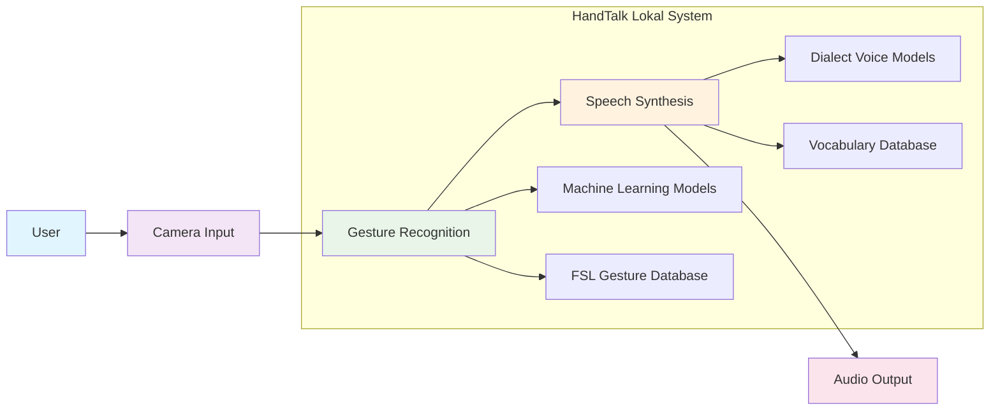

# System Architecture for HandTalk Lokal

## Overview
HandTalk Lokal is an offline-capable hand sign-to-speech translation and learning system for local Filipino dialects. The system uses computer vision and machine learning to recognize Filipino Sign Language (FSL) gestures and convert them into speech in selected local dialects (Ilocano, Hiligaynon, and Maranao).

## Simple System Architecture

## Core Components

### 1. User Interface
The user interacts with the system through:
- **Camera Input**: Captures hand gestures using device camera
- **Display**: Shows application interface and feedback
- **Audio Output**: Delivers translated speech to user

### 2. Gesture Recognition System
Processes visual input to identify sign language gestures:
- **Computer Vision Engine**: Detects and tracks hand movements
- **FSL Gesture Database**: Collection of labeled Filipino Sign Language gestures
- **Machine Learning Models**: Pre-trained models for gesture recognition

### 3. Speech Synthesis System
Converts recognized gestures into spoken words:
- **Vocabulary Database**: Collection of words/phrases in local dialects
- **Dialect Voice Models**: Voice synthesis for Ilocano, Hiligaynon, and Maranao
- **Text-to-Speech Engine**: Converts text to audible speech

## Simple Data Flow

1. **User** performs a sign language gesture in front of the camera
2. **Camera** captures the gesture as video input
3. **Gesture Recognition** system processes the video using ML models
4. **System** matches gesture with entries in FSL database
5. **Speech Synthesis** retrieves corresponding word/phrase from vocabulary
6. **System** converts text to speech using appropriate dialect voice model
7. **Audio Output** delivers translated speech to the user

## Key Features

- **Offline Operation**: Works without internet connection
- **Multi-dialect Support**: Ilocano, Hiligaynon, and Maranao
- **Real-time Translation**: Instant gesture-to-speech conversion
- **Learning Modules**: Interactive lessons for sign language education
- **Accessibility Focus**: Designed for hearing-impaired users

## Component Descriptions

### User Interface
- **Camera Input**: Smartphone or webcam that captures user's hand gestures
- **Display**: Touchscreen interface for system interaction and feedback
- **Audio Output**: Speakers or headphones that deliver translated speech

### Gesture Recognition System
- **Computer Vision Engine**: Uses MediaPipe/TensorFlow for real-time gesture detection
- **FSL Gesture Database**: Locally stored collection of labeled Filipino Sign Language gestures
- **Machine Learning Models**: Pre-trained models optimized for FSL recognition

### Speech Synthesis System
- **Vocabulary Database**: Collection of words and phrases in supported dialects
- **Dialect Voice Models**: Specialized text-to-speech engines for each dialect
- **Text-to-Speech Engine**: Converts recognized text into audible speech

## How It Works

1. User opens the HandTalk Lokal app and selects preferred dialect
2. User performs a Filipino Sign Language gesture in front of the camera
3. System captures the gesture using computer vision technology
4. Machine learning models analyze the gesture and identify it
5. System matches the gesture with corresponding word/phrase in database
6. Text-to-speech engine converts the word/phrase to speech
7. Translated speech is delivered in the selected local dialect
8. User can also access learning modules to practice sign language

This simplified architecture focuses on the essential components and workflow of the HandTalk Lokal system, making it easier to understand the core functionality without getting into complex technical details.
