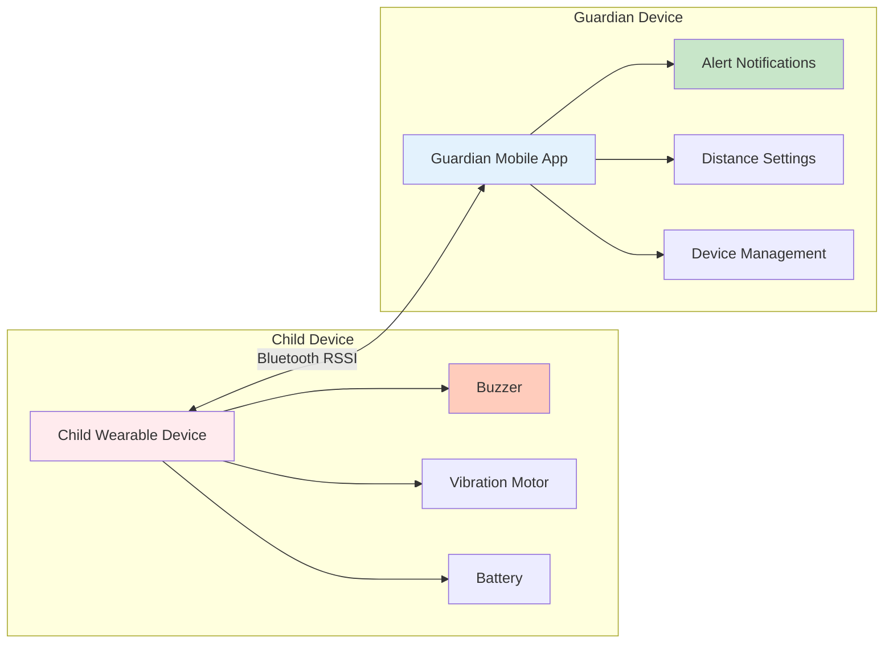

# System Architecture for StayClose

## Overview
StayClose is a wearable safety alert system for children in public spaces utilizing Bluetooth RSSI distance algorithm. The system uses Bluetooth technology to monitor the distance between a child-worn device and a guardian's mobile device, providing real-time alerts when the child moves beyond a safe distance.

## Simple System Architecture

## Core Components

### 1. Child Wearable Device
The wearable device that the child carries or wears:
- **ESP32/Arduino Nano 33 IoT**: Main processor
- **Bluetooth Module**: Communicates with guardian's device
- **Buzzer**: Audio alert for the child
- **Vibration Motor**: Tactile alert for the child
- **Battery**: Power source

### 2. Guardian Mobile Application
The smartphone app used by the parent/guardian:
- **Distance Monitoring**: Tracks child's proximity using Bluetooth RSSI
- **Alert System**: Notifies guardian when child moves too far
- **Settings**: Configure safe distance range (2-10 meters)
- **Device Management**: Pair/unpair devices

### 3. Bluetooth RSSI Communication
The wireless link between devices:
- **Signal Strength Monitoring**: Measures distance via RSSI values
- **Real-time Connection**: Continuous monitoring
- **Offline Operation**: Works without internet

## Simple Data Flow

1. **Child Device** continuously broadcasts Bluetooth signals
2. **Guardian App** receives signal strength (RSSI) values
3. **System** calculates approximate distance from RSSI
4. **If** distance exceeds safe range → **Alert triggered**
5. **Guardian** receives notification on mobile app
6. **Child** receives alert via buzzer/vibration

## Key Features

- **Real-time Monitoring**: Continuous distance tracking
- **Dual Alerts**: Both guardian (app) and child (device) alerted
- **Offline Operation**: No internet required
- **Configurable Range**: Adjustable safe distance (2-10 meters)
- **Low Cost**: Uses affordable hardware components

## Component Descriptions

### Child Wearable Device
- **ESP32/Arduino Nano 33 IoT**: Microcontroller that manages all device functions
- **Bluetooth Module**: Sends and receives Bluetooth signals for distance calculation
- **Buzzer**: Provides audible alert when child moves beyond safe range
- **Vibration Motor**: Provides tactile alert for children who may not hear the buzzer
- **Battery**: Powers the entire device (rechargeable recommended)

### Guardian Mobile Application
- **Distance Monitoring**: Uses Bluetooth RSSI values to calculate distance to child
- **Alert Notifications**: Sends visual and audible alerts to guardian's phone
- **Distance Settings**: Allows guardian to set safe distance parameters
- **Device Management**: Handles pairing and connection management

### Communication
- **Bluetooth RSSI**: Uses Received Signal Strength Indicator to estimate distance
- **Real-time Updates**: Continuous monitoring with immediate alerts
- **Reliable Connection**: Maintains connection within specified range

## How It Works

1. Guardian sets a safe distance range in the mobile app (e.g., 5 meters)
2. Child wears the device which continuously broadcasts Bluetooth signals
3. Guardian's phone receives these signals and measures their strength
4. System converts signal strength to distance measurement
5. When child moves beyond the safe range, both devices trigger alerts
6. Guardian receives notification on their phone
7. Child receives alert through buzzer sound and/or vibration
8. Guardian can then locate and retrieve the child

This simplified architecture focuses on the essential components and workflow of the StayClose system, making it easier to understand the core functionality without getting into complex technical details.
