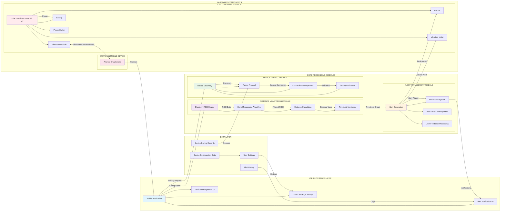

# System Architecture for StayClose

## Overview
StayClose is a wearable safety alert system for children in public spaces utilizing Bluetooth RSSI distance algorithm. The system uses Bluetooth technology to monitor the distance between a child-worn device and a guardian's mobile device, providing real-time alerts when the child moves beyond a safe distance.

## System Architecture

## Component Descriptions

### User Interface Layer
- **Mobile Application**: Primary interface for guardians to interact with the system
- **Distance Range Settings**: Allows guardians to set safe distance parameters (2-10 meters)
- **Alert Notification UI**: Visual and audible notifications when child moves beyond safe distance
- **Device Management UI**: Interface for pairing, unpairing, and managing connected devices

### Distance Monitoring Module
- **Bluetooth RSSI Engine**: Core engine responsible for monitoring Bluetooth signal strength
- **Signal Processing Algorithm**: Filters and processes raw RSSI values to reduce noise
- **Distance Calculation**: Converts RSSI values to approximate distance measurements
- **Threshold Monitoring**: Continuously compares calculated distance against safe range settings

### Alert Management Module
- **Alert Generation**: Creates alerts when child moves beyond safe distance
- **Notification System**: Manages delivery of alerts to guardian's mobile device
- **Alert Levels Management**: Handles different alert levels (warning and danger)
- **User Feedback Processing**: Processes user responses to alerts

### Device Pairing Module
- **Device Discovery**: Identifies available Bluetooth devices for pairing
- **Pairing Protocol**: Establishes secure connection between child device and guardian device
- **Connection Management**: Maintains and monitors device connections
- **Security Validation**: Ensures only authorized devices can connect

### Data Layer
- **Device Configuration Data**: Storage of device-specific settings and parameters
- **User Settings**: Guardian preferences for distance ranges and alert types
- **Alert History**: Log of all alerts generated by the system
- **Device Pairing Records**: Records of all paired devices

### Hardware
- **Child Wearable Device**: Physical device worn by child for monitoring
- **Guardian Mobile Device**: Smartphone running the StayClose application
- **Bluetooth Communication**: Wireless communication link between devices
- **Power Management**: Battery and power regulation for all components

### Wearable Components
- **ESP32/Arduino Nano 33 IoT**: Microcontroller for processing and control
- **Bluetooth Module**: Wireless communication component
- **Buzzer**: Audible alert component for child device
- **Vibration Motor**: Tactile alert component for child device
- **Battery**: Power source for child device
- **Power Switch**: Manual power control for child device

## Data Flow
1. Guardian interacts with Mobile Application to set distance parameters
2. Child Wearable Device continuously broadcasts Bluetooth signals
3. Guardian Mobile Device receives Bluetooth RSSI values
4. Bluetooth RSSI Engine processes signal strength data
5. Signal Processing Algorithm filters RSSI values to reduce noise
6. Distance Calculation converts RSSI to approximate distance
7. Threshold Monitoring compares distance against safe range
8. If distance exceeds threshold, Alert Generation creates notification
9. Notification System delivers alert to guardian's device
10. Alert is also triggered on child device via buzzer/vibration
11. All settings and alerts are stored in local data storage

## Offline Capabilities
The system is designed to function completely offline:
- Bluetooth communication does not require internet connectivity
- All processing occurs locally on devices
- Data storage is local to devices
- Alerts are generated and delivered without network dependence

## Safety Features
- Real-time distance monitoring with immediate alerts
- Dual alert system (mobile notification and wearable device alerts)
- Configurable distance thresholds (2-10 meters)
- Multiple alert levels (warning and danger)
- Local processing ensures no data privacy concerns
